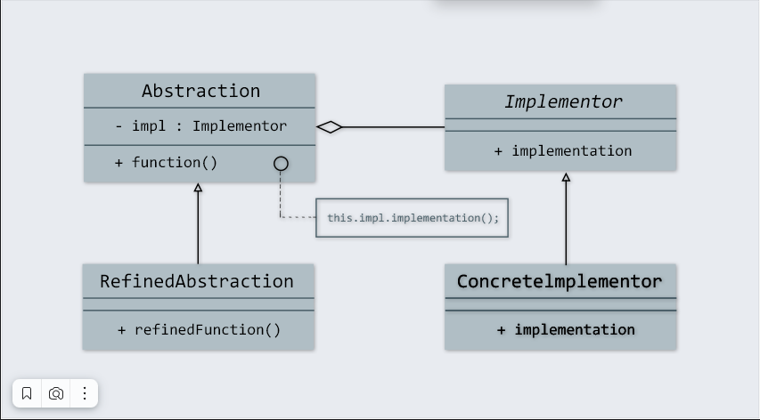

Устройство Bridge: что такое абстракция и реализация
Давай рассмотрим с тобой диаграмму классов, которая описывает паттерн Bridge:

Здесь можно увидеть две независимые структуры, которые могут модифицироваться, не затрагивая функционал друг друга.

В нашем случае это:
Abstraction — класс Shape;
RefinedAbstraction — классы Triangle, Rectangle;
Implementor — интерфейс Color;
ConcreteImplementor — классы BlackColor, GreenColor и RedColor.

Класс Shape представляет собой Абстракцию — механизм управления раскраской фигур в различные цвета, который делегирует 
Реализацию интерфейсу Color.

Классы Triangle, Rectangle являются реальными объектами, которые используют механизм, предложенный классом Shape.

BlackColor, GreenColor и RedColor — конкретные имплементации в ветке Реализация. Их часто называют платформой.

Где используют паттерн Bridge
Огромный плюс использования этого паттерна заключается в том, что можно вносить изменения в функционал классов одной ветки, не ломая при этом логику другой. Также такой подход помогает уменьшить связанность классов программы.

Главное условие применения паттернов — “следовать инструкции”: не совать их куда попало! Собственно, давай разберемся, в каких случаях точно нужно использовать Bridge:
Если необходимо расширить количество сущностей в две стороны (геометрические фигуры, цвета).

Если есть желание разделить большой класс, который не отвечает принципу Single responsibility, на более маленькие классы с узкопрофильным функционалом.

При возможной необходимости вносить изменения в логику работы неких сущностей во время работы программы.

При необходимости спрятать реализацию от клиентов класса (библиотеки).

При использовании паттерна каждый раз нужно помнить, что он добавляет дополнительные сущности в код — не совсем логично применять его в проекте, где всего одна геометрическая фигура и один-два возможных ее цвета.
Плюсы и минусы паттерна
Как и другие паттерны, у Моста есть и преимущества, и недостатки.

Преимущества Bridge:
1) Улучшает масштабируемость кода — можно добавлять функционал, не боясь сломать что-то в другой части программы.
2) Уменьшает количество подклассов — работает при необходимости расширения количества сущностей в две стороны (например, 
количество фигур и количество цветов).
3) Дает возможность отдельно работать над двумя самостоятельными ветками Абстракции и Реализации — это могут делать два 
разных разработчика, не вникая в детали кода друг друга.
4) Уменьшение связанности классов — единственное место связки двух классов — это мост (поле Color color).

Недостатки Bridge:
1) В зависимости от конкретной ситуации и структуры проекта в целом, возможно негативное влияние на продуктивность программы 
(например, если нужно инициализировать большее количество объектов).
2) Усложняет читаемость кода из-за необходимости навигации между классами.

Отличие от паттерна Strategy
Паттерн Bridge часто путают с другим шаблоном проектирования — Strategy. Они оба используют композицию (в примере с 
фигурами и цветами мы использовали агрегацию, но паттерн Bridge может использовать и композицию), делегируя работу 
другим объектам. Но разница между ними есть, и она огромная. Паттерн Strategy является поведенческим паттерном: он 
решает совсем другие задачи. Strategy обеспечивает взаимозаменяемость алгоритмов, в то время как Bridge отделяет 
абстракцию от реализации, чтобы обеспечить возможность выбора между различными имплементациями. То есть, Bridge, в 
отличие от Strategy, применяется к целым конструкциям или иерархическим структурам.